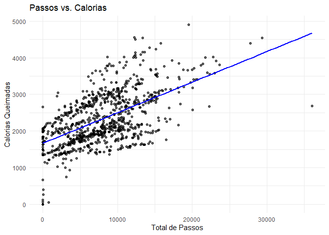
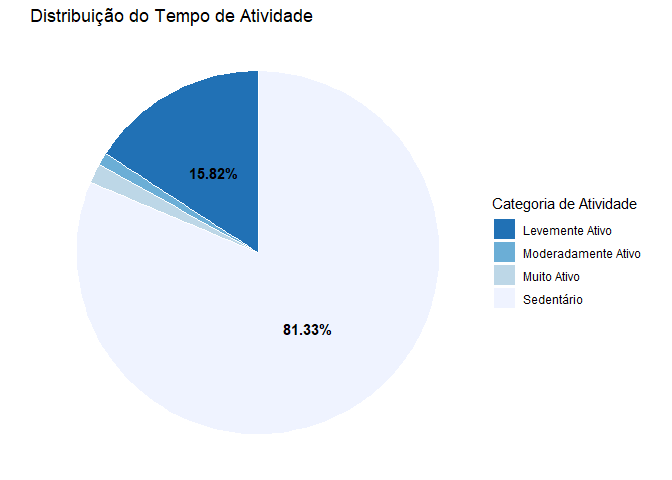
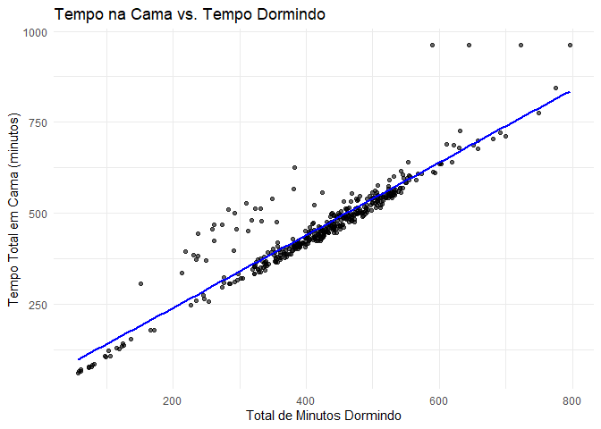
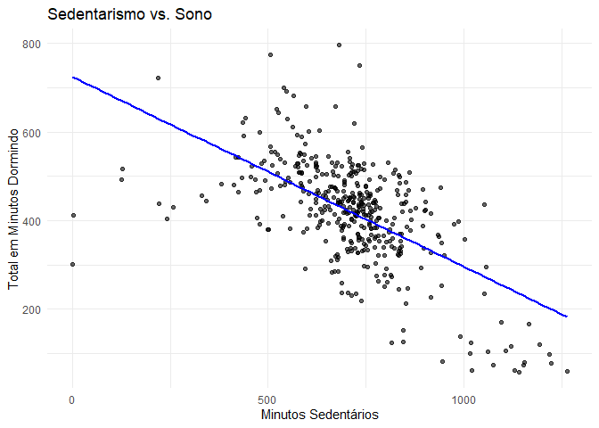
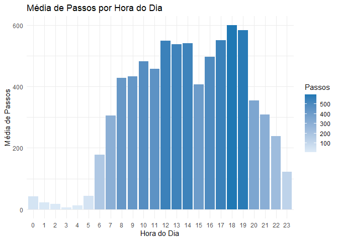
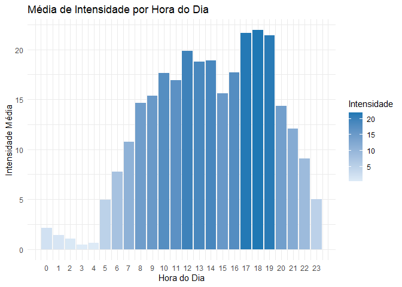
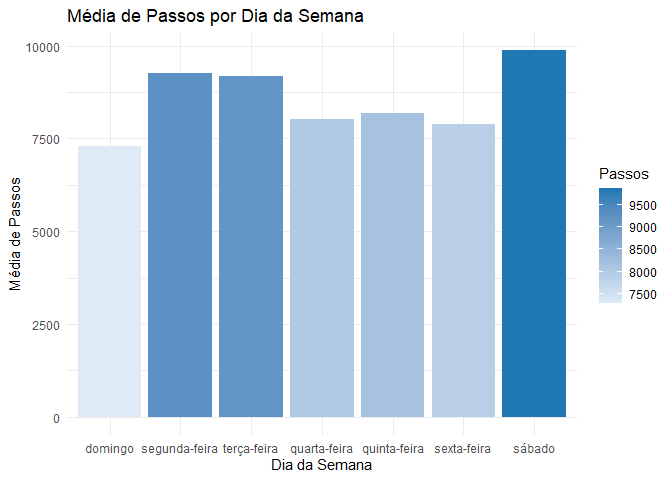
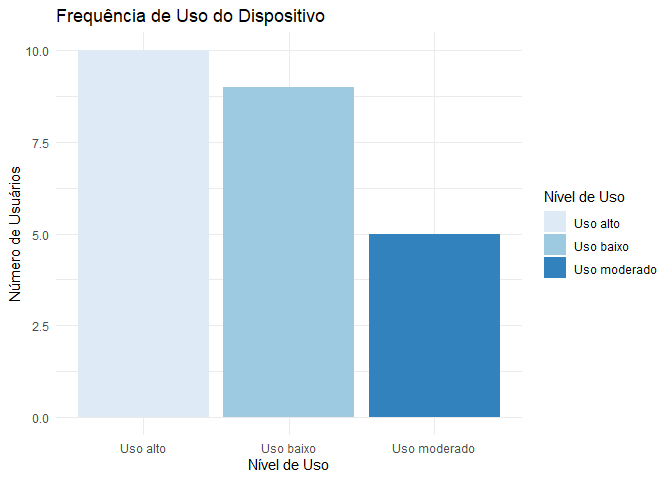
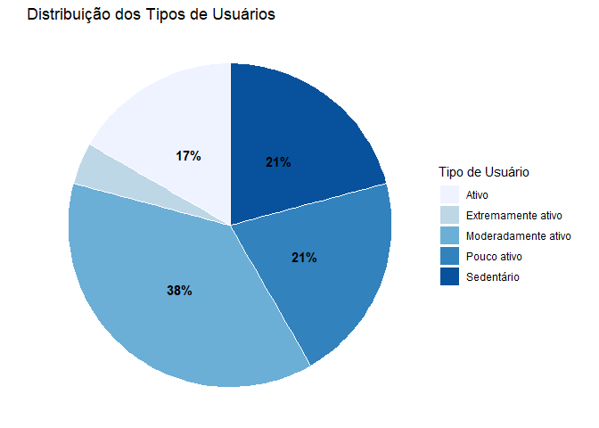

Estudo de Caso com R - Bellabeat
================
Gabriel Silva
2026-02-04

# Perguntar

## Sobre a empresa

Urška Sršen e Sando Mur fundaram a Bellabeat, uma empresa de alta
tecnologia que fabrica produtos inteligentes focados na saúde. Sršen
usou sua experiência como artista para desenvolver tecnologia com belo
design que informa e inspira mulheres ao redor do mundo. A coleta de
dados sobre atividade, sono, estresse e saúde reprodutiva permitiu que a
Bellabeat empoderasse as mulheres com conhecimento sobre sua própria
saúde e hábitos. Desde que foi fundada em 2013, a Bellabeat cresceu
rapidamente e rapidamente se posicionou como uma empresa de bem-estar
impulsionada pela tecnologia para mulheres. Em 2016, a Bellabeat abriu
escritórios ao redor do mundo e lançou vários produtos. Os produtos da
Bellabeat tornaram-se disponíveis através de um número crescente de
varejistas online, além de seu próprio canal de comércio eletrônico em
seu site. A empresa investiu em meios de publicidade tradicionais, como
rádio, outdoors, mídia impressa e televisão, mas foca extensivamente em
marketing digital. A Bellabeat investe o ano todo na Pesquisa do Google,
mantendo páginas ativas no Facebook e Instagram, e engaja
consistentemente os consumidores no Twitter. Além disso, a Bellabeat
exibe anúncios em vídeo no Youtube e anúncios gráficos na Rede de
Display do Google para apoiar campanhas em datas importantes de
marketing. Sršen sabe que uma análise dos dados de consumo disponíveis
da Bellabeat revelaria mais oportunidades de crescimento. Ela pediu à
equipe de análise de marketing para focar em um produto da Bellabeat e
analisar dados de uso de dispositivos inteligentes a fim de obter
insights sobre como as pessoas já estão usando seus dispositivos
inteligentes. Então, usando essas informações, ela gostaria de
recomendações de alto nível sobre como essas tendências podem informar a
estratégia de marketing da Bellabeat.

## Questões para a análise

- Quais são algumas tendências no uso de dispositivos inteligentes?
- Como essas tendências podem se aplicar aos clientes da Bellabeat?
- Como essas tendências podem ajudar a influenciar a estratégia de
  marketing da Bellabeat?

## Tarefa de negócios

Analisar dados de consumidores de dispositivos inteligentes para revelar
padrões de uso e tendências comportamentais, visando orientar a
estratégia de marketing da Bellabeat e desbloquear novas oportunidades
de crescimento no mercado de bem-estar.

## Definição de Sucesso

O sucesso desta análise não será medido apenas pela geração de gráficos
ou limpeza de dados, mas pela entrega de recomendações estratégicas que
sejam acionáveis e transformadoras.

Uma análise bem-sucedida deverá:

1.  **Revelar a Verdade:** Identificar tendências claras que desafiem ou
    validem as suposições atuais da diretoria.
2.  **Conectar Pontos:** Demonstrar, através de visualizações
    convincentes, como o comportamento observado pode ser atendido por
    funcionalidades específicas do ecossistema Bellabeat.
3.  **Inspirar Ação:** Fornecer à equipe executiva e de marketing uma
    narrativa baseada em dados que justifique o investimento em novas
    campanhas digitais e melhorias de produto, garantindo que a
    Bellabeat “jogue de forma inteligente” no mercado global.

# Preparar

## Instalando e carregando as bibliotecas

Antes de adentrarmos a floresta de dados brutos, precisamos equipar
nossa mochila com as ferramentas certas. No ambiente R, isso significa
convocar bibliotecas que transformarão caos em clareza. Não estamos
apenas carregando códigos; estamos ativando superpoderes específicos:

- O tidyverse servirá como nosso canivete suíço para manipulação de
  dados.
- O lubridate será nosso cronômetro de precisão para decifrar as
  variáveis de tempo.
- O ggplot2 será nossa câmera, pronta para capturar e revelar a beleza
  visual escondida nos números.

``` r
library(dplyr)
library(ggplot2)
library(tidyr)
library(lubridate)
library(tidyverse)
```

## Carregando o Conjunto de dados

Nossa matéria-prima provém de uma fonte pública, uma coleção de
registros digitais de 33 usuários anônimos que consentiram em
compartilhar suas jornadas de saúde. Ao carregar arquivos como
dailyActivity_merged.csv e sleepDay_merged.csv, não estamos apenas
importando planilhas; estamos trazendo para nossa mesa de trabalho os
batimentos cardíacos, os passos cansados e as noites de sono de pessoas
reais. Este é o momento em que a realidade do usuário encontra a nossa
capacidade analítica.

``` r
activity <- read.csv("C:/Workspace/R/Datasets/mturkfitbit_export_4.12.16-5.12.16/Fitabase Data 4.12.16-5.12.16/dailyActivity_merged.csv")
calories <- read.csv("C:/Workspace/R/Datasets/mturkfitbit_export_4.12.16-5.12.16/Fitabase Data 4.12.16-5.12.16/dailyCalories_merged.csv")
hourly_intensities <- read.csv("C:/Workspace/R/Datasets/mturkfitbit_export_4.12.16-5.12.16/Fitabase Data 4.12.16-5.12.16/hourlyIntensities_merged.csv")
hourly_steps <- read.csv("C:/Workspace/R/Datasets/mturkfitbit_export_4.12.16-5.12.16/Fitabase Data 4.12.16-5.12.16/hourlySteps_merged.csv")
sleep <- read.csv("C:/Workspace/R/Datasets/mturkfitbit_export_4.12.16-5.12.16/Fitabase Data 4.12.16-5.12.16/sleepDay_merged.csv")
weight <- read.csv("C:/Workspace/R/Datasets/mturkfitbit_export_4.12.16-5.12.16/Fitabase Data 4.12.16-5.12.16/weightLogInfo_merged.csv")
```

# Processo

## Entendendo os conjuntos de dados

Antes de podermos extrair qualquer sabedoria destes números, precisamos
“apertar a mão” dos nossos dados. Começamos nossa exploração técnica
realizando um reconhecimento tático do território. Utilizando funções
como dim, colnames e str, mapeamos a arquitetura da informação à nossa
frente:

- Confirmamos que o conjunto de atividades diárias é o nosso pilar
  central, com 940 observações e 15 variáveis detalhadas.
- Ao examinar as primeiras linhas (head) e os tipos de dados,
  verificamos se o R está interpretando números como números e datas
  como texto, uma distinção crucial para evitar erros de cálculo
  futuros.
- O comando summary serviu como nosso primeiro “check-up” de saúde,
  revelando a distribuição estatística dos passos, calorias e minutos de
  sono, garantindo que os valores estivessem dentro de faixas
  humanamente possíveis.

Esta etapa não serviu apenas para listar tabelas, mas para estabelecer a
confiança necessária na fundação sobre a qual construiremos nossa
estratégia.

### Número de linhas e colunas dos conjuntos de dados

``` r
dim(activity)
```

    ## [1] 940  15

``` r
dim(calories)
```

    ## [1] 940   3

``` r
dim(hourly_intensities)
```

    ## [1] 22099     4

``` r
dim(hourly_steps)
```

    ## [1] 22099     3

``` r
dim(sleep)
```

    ## [1] 413   5

``` r
dim(weight)
```

    ## [1] 67  8

### Nome das colunas dos conjuntos de dados

``` r
colnames(activity)
```

    ##  [1] "Id"                       "ActivityDate"            
    ##  [3] "TotalSteps"               "TotalDistance"           
    ##  [5] "TrackerDistance"          "LoggedActivitiesDistance"
    ##  [7] "VeryActiveDistance"       "ModeratelyActiveDistance"
    ##  [9] "LightActiveDistance"      "SedentaryActiveDistance" 
    ## [11] "VeryActiveMinutes"        "FairlyActiveMinutes"     
    ## [13] "LightlyActiveMinutes"     "SedentaryMinutes"        
    ## [15] "Calories"

``` r
colnames(calories)
```

    ## [1] "Id"          "ActivityDay" "Calories"

``` r
colnames(hourly_intensities)
```

    ## [1] "Id"               "ActivityHour"     "TotalIntensity"   "AverageIntensity"

``` r
colnames(hourly_steps)
```

    ## [1] "Id"           "ActivityHour" "StepTotal"

``` r
colnames(sleep)
```

    ## [1] "Id"                 "SleepDay"           "TotalSleepRecords" 
    ## [4] "TotalMinutesAsleep" "TotalTimeInBed"

``` r
colnames(weight)
```

    ## [1] "Id"             "Date"           "WeightKg"       "WeightPounds"  
    ## [5] "Fat"            "BMI"            "IsManualReport" "LogId"

### Primeiras linhas dos conjuntos de dados

``` r
head(activity)
```

    ##           Id ActivityDate TotalSteps TotalDistance TrackerDistance
    ## 1 1503960366    4/12/2016      13162          8.50            8.50
    ## 2 1503960366    4/13/2016      10735          6.97            6.97
    ## 3 1503960366    4/14/2016      10460          6.74            6.74
    ## 4 1503960366    4/15/2016       9762          6.28            6.28
    ## 5 1503960366    4/16/2016      12669          8.16            8.16
    ## 6 1503960366    4/17/2016       9705          6.48            6.48
    ##   LoggedActivitiesDistance VeryActiveDistance ModeratelyActiveDistance
    ## 1                        0               1.88                     0.55
    ## 2                        0               1.57                     0.69
    ## 3                        0               2.44                     0.40
    ## 4                        0               2.14                     1.26
    ## 5                        0               2.71                     0.41
    ## 6                        0               3.19                     0.78
    ##   LightActiveDistance SedentaryActiveDistance VeryActiveMinutes
    ## 1                6.06                       0                25
    ## 2                4.71                       0                21
    ## 3                3.91                       0                30
    ## 4                2.83                       0                29
    ## 5                5.04                       0                36
    ## 6                2.51                       0                38
    ##   FairlyActiveMinutes LightlyActiveMinutes SedentaryMinutes Calories
    ## 1                  13                  328              728     1985
    ## 2                  19                  217              776     1797
    ## 3                  11                  181             1218     1776
    ## 4                  34                  209              726     1745
    ## 5                  10                  221              773     1863
    ## 6                  20                  164              539     1728

``` r
head(calories)
```

    ##           Id ActivityDay Calories
    ## 1 1503960366   4/12/2016     1985
    ## 2 1503960366   4/13/2016     1797
    ## 3 1503960366   4/14/2016     1776
    ## 4 1503960366   4/15/2016     1745
    ## 5 1503960366   4/16/2016     1863
    ## 6 1503960366   4/17/2016     1728

``` r
head(hourly_intensities)
```

    ##           Id          ActivityHour TotalIntensity AverageIntensity
    ## 1 1503960366 4/12/2016 12:00:00 AM             20         0.333333
    ## 2 1503960366  4/12/2016 1:00:00 AM              8         0.133333
    ## 3 1503960366  4/12/2016 2:00:00 AM              7         0.116667
    ## 4 1503960366  4/12/2016 3:00:00 AM              0         0.000000
    ## 5 1503960366  4/12/2016 4:00:00 AM              0         0.000000
    ## 6 1503960366  4/12/2016 5:00:00 AM              0         0.000000

``` r
head(hourly_steps)
```

    ##           Id          ActivityHour StepTotal
    ## 1 1503960366 4/12/2016 12:00:00 AM       373
    ## 2 1503960366  4/12/2016 1:00:00 AM       160
    ## 3 1503960366  4/12/2016 2:00:00 AM       151
    ## 4 1503960366  4/12/2016 3:00:00 AM         0
    ## 5 1503960366  4/12/2016 4:00:00 AM         0
    ## 6 1503960366  4/12/2016 5:00:00 AM         0

``` r
head(sleep)
```

    ##           Id              SleepDay TotalSleepRecords TotalMinutesAsleep
    ## 1 1503960366 4/12/2016 12:00:00 AM                 1                327
    ## 2 1503960366 4/13/2016 12:00:00 AM                 2                384
    ## 3 1503960366 4/15/2016 12:00:00 AM                 1                412
    ## 4 1503960366 4/16/2016 12:00:00 AM                 2                340
    ## 5 1503960366 4/17/2016 12:00:00 AM                 1                700
    ## 6 1503960366 4/19/2016 12:00:00 AM                 1                304
    ##   TotalTimeInBed
    ## 1            346
    ## 2            407
    ## 3            442
    ## 4            367
    ## 5            712
    ## 6            320

``` r
head(weight)
```

    ##           Id                  Date WeightKg WeightPounds Fat   BMI
    ## 1 1503960366  5/2/2016 11:59:59 PM     52.6     115.9631  22 22.65
    ## 2 1503960366  5/3/2016 11:59:59 PM     52.6     115.9631  NA 22.65
    ## 3 1927972279  4/13/2016 1:08:52 AM    133.5     294.3171  NA 47.54
    ## 4 2873212765 4/21/2016 11:59:59 PM     56.7     125.0021  NA 21.45
    ## 5 2873212765 5/12/2016 11:59:59 PM     57.3     126.3249  NA 21.69
    ## 6 4319703577 4/17/2016 11:59:59 PM     72.4     159.6147  25 27.45
    ##   IsManualReport        LogId
    ## 1           True 1.462234e+12
    ## 2           True 1.462320e+12
    ## 3          False 1.460510e+12
    ## 4           True 1.461283e+12
    ## 5           True 1.463098e+12
    ## 6           True 1.460938e+12

### Entendendo os tipos das variáveis dos conjuntos de dados

``` r
str(activity)
```

    ## 'data.frame':    940 obs. of  15 variables:
    ##  $ Id                      : num  1.5e+09 1.5e+09 1.5e+09 1.5e+09 1.5e+09 ...
    ##  $ ActivityDate            : chr  "4/12/2016" "4/13/2016" "4/14/2016" "4/15/2016" ...
    ##  $ TotalSteps              : int  13162 10735 10460 9762 12669 9705 13019 15506 10544 9819 ...
    ##  $ TotalDistance           : num  8.5 6.97 6.74 6.28 8.16 ...
    ##  $ TrackerDistance         : num  8.5 6.97 6.74 6.28 8.16 ...
    ##  $ LoggedActivitiesDistance: num  0 0 0 0 0 0 0 0 0 0 ...
    ##  $ VeryActiveDistance      : num  1.88 1.57 2.44 2.14 2.71 ...
    ##  $ ModeratelyActiveDistance: num  0.55 0.69 0.4 1.26 0.41 ...
    ##  $ LightActiveDistance     : num  6.06 4.71 3.91 2.83 5.04 ...
    ##  $ SedentaryActiveDistance : num  0 0 0 0 0 0 0 0 0 0 ...
    ##  $ VeryActiveMinutes       : int  25 21 30 29 36 38 42 50 28 19 ...
    ##  $ FairlyActiveMinutes     : int  13 19 11 34 10 20 16 31 12 8 ...
    ##  $ LightlyActiveMinutes    : int  328 217 181 209 221 164 233 264 205 211 ...
    ##  $ SedentaryMinutes        : int  728 776 1218 726 773 539 1149 775 818 838 ...
    ##  $ Calories                : int  1985 1797 1776 1745 1863 1728 1921 2035 1786 1775 ...

``` r
str(calories)
```

    ## 'data.frame':    940 obs. of  3 variables:
    ##  $ Id         : num  1.5e+09 1.5e+09 1.5e+09 1.5e+09 1.5e+09 ...
    ##  $ ActivityDay: chr  "4/12/2016" "4/13/2016" "4/14/2016" "4/15/2016" ...
    ##  $ Calories   : int  1985 1797 1776 1745 1863 1728 1921 2035 1786 1775 ...

``` r
str(hourly_intensities)
```

    ## 'data.frame':    22099 obs. of  4 variables:
    ##  $ Id              : num  1.5e+09 1.5e+09 1.5e+09 1.5e+09 1.5e+09 ...
    ##  $ ActivityHour    : chr  "4/12/2016 12:00:00 AM" "4/12/2016 1:00:00 AM" "4/12/2016 2:00:00 AM" "4/12/2016 3:00:00 AM" ...
    ##  $ TotalIntensity  : int  20 8 7 0 0 0 0 0 13 30 ...
    ##  $ AverageIntensity: num  0.333 0.133 0.117 0 0 ...

``` r
str(hourly_steps)
```

    ## 'data.frame':    22099 obs. of  3 variables:
    ##  $ Id          : num  1.5e+09 1.5e+09 1.5e+09 1.5e+09 1.5e+09 ...
    ##  $ ActivityHour: chr  "4/12/2016 12:00:00 AM" "4/12/2016 1:00:00 AM" "4/12/2016 2:00:00 AM" "4/12/2016 3:00:00 AM" ...
    ##  $ StepTotal   : int  373 160 151 0 0 0 0 0 250 1864 ...

``` r
str(sleep)
```

    ## 'data.frame':    413 obs. of  5 variables:
    ##  $ Id                : num  1.5e+09 1.5e+09 1.5e+09 1.5e+09 1.5e+09 ...
    ##  $ SleepDay          : chr  "4/12/2016 12:00:00 AM" "4/13/2016 12:00:00 AM" "4/15/2016 12:00:00 AM" "4/16/2016 12:00:00 AM" ...
    ##  $ TotalSleepRecords : int  1 2 1 2 1 1 1 1 1 1 ...
    ##  $ TotalMinutesAsleep: int  327 384 412 340 700 304 360 325 361 430 ...
    ##  $ TotalTimeInBed    : int  346 407 442 367 712 320 377 364 384 449 ...

``` r
str(weight)
```

    ## 'data.frame':    67 obs. of  8 variables:
    ##  $ Id            : num  1.50e+09 1.50e+09 1.93e+09 2.87e+09 2.87e+09 ...
    ##  $ Date          : chr  "5/2/2016 11:59:59 PM" "5/3/2016 11:59:59 PM" "4/13/2016 1:08:52 AM" "4/21/2016 11:59:59 PM" ...
    ##  $ WeightKg      : num  52.6 52.6 133.5 56.7 57.3 ...
    ##  $ WeightPounds  : num  116 116 294 125 126 ...
    ##  $ Fat           : int  22 NA NA NA NA 25 NA NA NA NA ...
    ##  $ BMI           : num  22.6 22.6 47.5 21.5 21.7 ...
    ##  $ IsManualReport: chr  "True" "True" "False" "True" ...
    ##  $ LogId         : num  1.46e+12 1.46e+12 1.46e+12 1.46e+12 1.46e+12 ...

### Resumo dos dados dos conjuntos de dados

``` r
summary(activity)
```

    ##        Id            ActivityDate         TotalSteps    TotalDistance   
    ##  Min.   :1.504e+09   Length:940         Min.   :    0   Min.   : 0.000  
    ##  1st Qu.:2.320e+09   Class :character   1st Qu.: 3790   1st Qu.: 2.620  
    ##  Median :4.445e+09   Mode  :character   Median : 7406   Median : 5.245  
    ##  Mean   :4.855e+09                      Mean   : 7638   Mean   : 5.490  
    ##  3rd Qu.:6.962e+09                      3rd Qu.:10727   3rd Qu.: 7.713  
    ##  Max.   :8.878e+09                      Max.   :36019   Max.   :28.030  
    ##  TrackerDistance  LoggedActivitiesDistance VeryActiveDistance
    ##  Min.   : 0.000   Min.   :0.0000           Min.   : 0.000    
    ##  1st Qu.: 2.620   1st Qu.:0.0000           1st Qu.: 0.000    
    ##  Median : 5.245   Median :0.0000           Median : 0.210    
    ##  Mean   : 5.475   Mean   :0.1082           Mean   : 1.503    
    ##  3rd Qu.: 7.710   3rd Qu.:0.0000           3rd Qu.: 2.052    
    ##  Max.   :28.030   Max.   :4.9421           Max.   :21.920    
    ##  ModeratelyActiveDistance LightActiveDistance SedentaryActiveDistance
    ##  Min.   :0.0000           Min.   : 0.000      Min.   :0.000000       
    ##  1st Qu.:0.0000           1st Qu.: 1.945      1st Qu.:0.000000       
    ##  Median :0.2400           Median : 3.365      Median :0.000000       
    ##  Mean   :0.5675           Mean   : 3.341      Mean   :0.001606       
    ##  3rd Qu.:0.8000           3rd Qu.: 4.783      3rd Qu.:0.000000       
    ##  Max.   :6.4800           Max.   :10.710      Max.   :0.110000       
    ##  VeryActiveMinutes FairlyActiveMinutes LightlyActiveMinutes SedentaryMinutes
    ##  Min.   :  0.00    Min.   :  0.00      Min.   :  0.0        Min.   :   0.0  
    ##  1st Qu.:  0.00    1st Qu.:  0.00      1st Qu.:127.0        1st Qu.: 729.8  
    ##  Median :  4.00    Median :  6.00      Median :199.0        Median :1057.5  
    ##  Mean   : 21.16    Mean   : 13.56      Mean   :192.8        Mean   : 991.2  
    ##  3rd Qu.: 32.00    3rd Qu.: 19.00      3rd Qu.:264.0        3rd Qu.:1229.5  
    ##  Max.   :210.00    Max.   :143.00      Max.   :518.0        Max.   :1440.0  
    ##     Calories   
    ##  Min.   :   0  
    ##  1st Qu.:1828  
    ##  Median :2134  
    ##  Mean   :2304  
    ##  3rd Qu.:2793  
    ##  Max.   :4900

``` r
summary(calories)
```

    ##        Id            ActivityDay           Calories   
    ##  Min.   :1.504e+09   Length:940         Min.   :   0  
    ##  1st Qu.:2.320e+09   Class :character   1st Qu.:1828  
    ##  Median :4.445e+09   Mode  :character   Median :2134  
    ##  Mean   :4.855e+09                      Mean   :2304  
    ##  3rd Qu.:6.962e+09                      3rd Qu.:2793  
    ##  Max.   :8.878e+09                      Max.   :4900

``` r
summary(hourly_intensities)
```

    ##        Id            ActivityHour       TotalIntensity   AverageIntensity
    ##  Min.   :1.504e+09   Length:22099       Min.   :  0.00   Min.   :0.0000  
    ##  1st Qu.:2.320e+09   Class :character   1st Qu.:  0.00   1st Qu.:0.0000  
    ##  Median :4.445e+09   Mode  :character   Median :  3.00   Median :0.0500  
    ##  Mean   :4.848e+09                      Mean   : 12.04   Mean   :0.2006  
    ##  3rd Qu.:6.962e+09                      3rd Qu.: 16.00   3rd Qu.:0.2667  
    ##  Max.   :8.878e+09                      Max.   :180.00   Max.   :3.0000

``` r
summary(hourly_steps)
```

    ##        Id            ActivityHour         StepTotal      
    ##  Min.   :1.504e+09   Length:22099       Min.   :    0.0  
    ##  1st Qu.:2.320e+09   Class :character   1st Qu.:    0.0  
    ##  Median :4.445e+09   Mode  :character   Median :   40.0  
    ##  Mean   :4.848e+09                      Mean   :  320.2  
    ##  3rd Qu.:6.962e+09                      3rd Qu.:  357.0  
    ##  Max.   :8.878e+09                      Max.   :10554.0

``` r
summary(sleep)
```

    ##        Id              SleepDay         TotalSleepRecords TotalMinutesAsleep
    ##  Min.   :1.504e+09   Length:413         Min.   :1.000     Min.   : 58.0     
    ##  1st Qu.:3.977e+09   Class :character   1st Qu.:1.000     1st Qu.:361.0     
    ##  Median :4.703e+09   Mode  :character   Median :1.000     Median :433.0     
    ##  Mean   :5.001e+09                      Mean   :1.119     Mean   :419.5     
    ##  3rd Qu.:6.962e+09                      3rd Qu.:1.000     3rd Qu.:490.0     
    ##  Max.   :8.792e+09                      Max.   :3.000     Max.   :796.0     
    ##  TotalTimeInBed 
    ##  Min.   : 61.0  
    ##  1st Qu.:403.0  
    ##  Median :463.0  
    ##  Mean   :458.6  
    ##  3rd Qu.:526.0  
    ##  Max.   :961.0

``` r
summary(weight)
```

    ##        Id                Date              WeightKg       WeightPounds  
    ##  Min.   :1.504e+09   Length:67          Min.   : 52.60   Min.   :116.0  
    ##  1st Qu.:6.962e+09   Class :character   1st Qu.: 61.40   1st Qu.:135.4  
    ##  Median :6.962e+09   Mode  :character   Median : 62.50   Median :137.8  
    ##  Mean   :7.009e+09                      Mean   : 72.04   Mean   :158.8  
    ##  3rd Qu.:8.878e+09                      3rd Qu.: 85.05   3rd Qu.:187.5  
    ##  Max.   :8.878e+09                      Max.   :133.50   Max.   :294.3  
    ##                                                                         
    ##       Fat             BMI        IsManualReport         LogId          
    ##  Min.   :22.00   Min.   :21.45   Length:67          Min.   :1.460e+12  
    ##  1st Qu.:22.75   1st Qu.:23.96   Class :character   1st Qu.:1.461e+12  
    ##  Median :23.50   Median :24.39   Mode  :character   Median :1.462e+12  
    ##  Mean   :23.50   Mean   :25.19                      Mean   :1.462e+12  
    ##  3rd Qu.:24.25   3rd Qu.:25.56                      3rd Qu.:1.462e+12  
    ##  Max.   :25.00   Max.   :47.54                      Max.   :1.463e+12  
    ##  NA's   :65

## Limpeza dos conjuntos de dados

Toda boa história precisa de personagens incríveis. Ao investigarmos a
fundo quem são os protagonistas dos nossos dados através da função
n_distinct, nos deparamos com um obstáculo crítico. Enquanto os dados de
atividade e calorias contavam com a participação de 33 usuários, uma
amostra pequena, mas utilizável, o conjunto de dados de peso revelou ter
apenas 8 usuários únicos.

Aqui, tomamos uma decisão vital para a integridade da nossa análise:
descartar os dados de peso. Tentar extrapolar tendências de mercado
baseadas em apenas 8 pessoas seria irresponsável e introduziria um viés
perigoso. Focaremos nossa lente analítica onde a evidência é mais
robusta: nos hábitos de atividade e sono.

### Quantas pessoas estamos analisando?

``` r
n_distinct(activity$Id)
```

    ## [1] 33

``` r
n_distinct(calories$Id)
```

    ## [1] 33

``` r
n_distinct(hourly_intensities$Id)
```

    ## [1] 33

``` r
n_distinct(hourly_steps$Id)
```

    ## [1] 33

``` r
n_distinct(sleep$Id)
```

    ## [1] 24

``` r
n_distinct(weight$Id)
```

    ## [1] 8

### Os conjuntos de dados possuem valores ausentes?

``` r
anyNA(activity)
```

    ## [1] FALSE

``` r
anyNA(calories)
```

    ## [1] FALSE

``` r
anyNA(hourly_intensities)
```

    ## [1] FALSE

``` r
anyNA(hourly_steps)
```

    ## [1] FALSE

``` r
anyNA(sleep)
```

    ## [1] FALSE

Verificamos que não possuem.

### Os conjuntos de dados possuem valores duplicados

``` r
any(duplicated(activity))
```

    ## [1] FALSE

``` r
any(duplicated(calories))
```

    ## [1] FALSE

``` r
any(duplicated(hourly_intensities))
```

    ## [1] FALSE

``` r
any(duplicated(hourly_steps))
```

    ## [1] FALSE

``` r
any(duplicated(sleep))
```

    ## [1] TRUE

Verificamos que apenas o conjunto de dados de sono dos usuários possui
dados duplicados.

### Tratandos os valores duplicados do conjunto de dados de sono

``` r
sleep_non_duplicated <- sleep[!duplicated(sleep),]
any(duplicated(sleep_non_duplicated))
```

    ## [1] FALSE

Dados brutos raramente são puros; eles costumam vir acompanhados de
“ruídos”, erros de registro e repetições que podem distorcer a
realidade. Assumindo o papel de detetives digitais, varremos os dados em
busca de falhas:

- **Valores Ausentes:** Felizmente, nossa verificação com anyNA retornou
  que os conjuntos de dados não possuem buracos críticos que precisassem
  de preenchimento artificial.
- **O Eco dos Dados:** Ao caçar duplicatas, descobrimos que os registros
  de atividade estavam limpos, mas o conjunto de dados de sono continha
  repetições. Três registros duplicados foram identificados, como ecos
  distorcendo uma mensagem clara. Imediatamente higienizamos essa
  tabela, removendo as duplicatas para garantir que cada minuto de sono
  fosse contado apenas uma vez, restaurando a precisão da nossa análise.

### Formatando as datas

``` r
activity_clean <- activity %>% 
  rename_with(tolower) %>% 
  mutate(activitydate = mdy(activitydate))

calories_clean <- calories %>% 
  rename_with(tolower) %>%
  rename(activitydate = activityday) %>% 
  mutate(activitydate = mdy(activitydate))

intensities_clean <- hourly_intensities %>% 
  rename_with(tolower) %>% 
  rename(activitydate = activityhour) %>% 
  mutate(activitydate = mdy_hms(activitydate)) %>% 
  mutate(dayhour = hour(activitydate))

steps_clean <- hourly_steps %>% 
  rename_with(tolower) %>% 
  rename(activitydate = activityhour) %>% 
  mutate(activitydate = mdy_hms(activitydate)) %>% 
  mutate(dayhour = hour(activitydate))

sleep_clean <- sleep_non_duplicated %>% 
  rename_with(tolower) %>% 
  rename(activitydate = sleepday) %>% 
  mutate(activitydate = as_date(mdy_hms(activitydate)))
```

Para descobrir quando os usuários são mais ativos, precisamos que todos
os dados falem a mesma língua temporal. Originalmente, o R interpretou
as datas como simples texto, o que nos impediria de calcular tendências
semanais ou horárias.

Realizamos então uma “tradução” técnica: \* Padronizamos todos os nomes
de colunas para minúsculas para evitar confusões de sintaxe. \*
Utilizando a biblioteca lubridate, convertemos as strings de data em
objetos de tempo reais. \* Extraímos cirurgicamente a “hora do dia” em
uma nova variável.

Isso não foi apenas uma formatação; foi a criação de uma linha do tempo
unificada que nos permitirá, na próxima etapa, visualizar a jornada do
usuário desde o momento em que acorda até a hora de dormir.

# Analisar

Nesta fase, deixamos de ser processadores de dados para nos tornarmos
detetives de comportamento. Nossos gráficos não são apenas imagens; são
janelas para a rotina diária das mulheres que queremos empoderar.
Buscamos entender não o “usuário ideal”, mas o “usuário real”, com suas
lutas, hábitos e motivações.

## **Andar mais queima mais calorias?**

**O Motivo da Investigação:** Começamos pelo fundamental. A premissa
básica de qualquer rastreador fitness é que o movimento gera resultados.
Precisamos validar se os dados confirmam essa “promessa” para
estabelecer confiança. Estamos buscando a correlação direta entre o
esforço (passos) e a recompensa (calorias).

``` r
ggplot(activity_clean, aes(x = totalsteps, y = calories)) +
  geom_point(color = "black", alpha = 0.6) + 
  geom_smooth(method = lm, color = "blue", se = FALSE) + 
  labs(
    title = "Passos vs. Calorias",
    x = "Total de Passos",
    y = "Calorias Queimadas"
  ) +
  theme_minimal()
```

<!-- -->

**A Revelação dos Dados:** Os dados confirmam a “lei do esforço”: existe
uma correlação positiva clara entre o total de passos e as calorias
queimadas. No entanto, a dispersão dos pontos nos conta uma história
mais sutil: nem todos os passos são iguais. Enquanto o volume importa,
vemos que a intensidade varia, sugerindo que caminhar é essencial, mas
não é a única variável na equação da saúde.

## **Como é dividido o dia médio de um usuário?**

**O Motivo da Investigação:** Para nos inserirmos na vida da usuária,
precisamos saber onde ela passa seu tempo. Ela está sempre em movimento
ou presa em uma mesa? Este gráfico busca mapear a realidade do dia a
dia, confrontando a expectativa de uma “vida ativa” com a realidade.

``` r
pizza_data <- activity_clean %>% 
  summarise(
    "Muito Ativo" = sum(veryactiveminutes),
    "Moderadamente Ativo" = sum(fairlyactiveminutes),
    "Levemente Ativo" = sum(lightlyactiveminutes),
    "Sedentário" = sum(sedentaryminutes)
  ) %>% 
  pivot_longer(cols = everything(), names_to = "Categoria", values_to = "Minutos") %>% 
  mutate(Percentage = Minutos / sum(Minutos)) %>% 
  mutate(Rotulos = scales::percent(Percentage))

ggplot(pizza_data, aes(x = "", y = Minutos, fill = Categoria)) +
  geom_bar(stat = "identity", width = 1, color = "white") +
  coord_polar("y", start = 0) +
  theme_void() + 
  geom_text(aes(label = ifelse(Percentage > 0.05, Rotulos, "")), 
            position = position_stack(vjust = 0.5), 
            color = "black", 
            fontface = "bold",
            size = 4) +
  scale_fill_brewer(palette = "Blues", direction = -1) + 
  labs(
    title = "Distribuição do Tempo de Atividade",
    fill = "Categoria de Atividade"
  )
```

<!-- -->

**A Revelação dos Dados:** Encontramos um “choque de realidade”: as
usuárias passam cerca de 81% do seu tempo acordado em comportamento
sedentário. O tempo “muito ativo” compõe uma fração minúscula do dia.
Isso define nosso principal antagonista: a inatividade prolongada. A
Bellabeat não está vendendo para atletas olímpicos, mas para mulheres
reais que lutam contra o sedentarismo cotidiano.

## **Qual a relação entre o tempo deitado e o sono?**

**O Motivo da Investigação:** A Bellabeat preza pelo bem-estar. Estar na
cama não significa descansar. Investigamos a eficiência do sono para
descobrir se nossas usuárias estão realmente recarregando as energias ou
se estão lutando para dormir.

``` r
merged_dataframe  <- merge(sleep_clean, activity_clean, by=c('id', 'activitydate'))
ggplot(merged_dataframe, aes(x = totalminutesasleep, y = totaltimeinbed)) +
  geom_point(color = "black", alpha = 0.6) + 
  geom_smooth(method = lm, color = "blue", se = FALSE) + 
  labs(
    title = "Tempo na Cama vs. Tempo Dormindo",
    x = "Total de Minutos Dormindo",
    y = "Tempo Total em Cama (minutos)"
  ) +
  theme_minimal()
```

<!-- -->

**A Revelação dos Dados:** Os dados revelam uma “fricção” no descanso.
Existe uma lacuna significativa entre o tempo na cama e o tempo
dormindo. Isso sugere hábitos de “rolar na cama”, possivelmente causados
pelo uso de telas ou estresse, indicando uma oportunidade clara para
funcionalidades de mindfulness e higiene do sono antes de dormir.

## **Sedentarismo atrapalha o sono?**

**O Motivo da Investigação:** Conectamos os pontos entre o dia e a
noite. Queremos saber se as escolhas feitas durante o dia impactam a
qualidade da noite. Estamos buscando provar que o rastreador Leaf não
serve apenas para contar passos, mas para garantir sonhos.

``` r
ggplot(merged_dataframe, aes(x = sedentaryminutes, y = totalminutesasleep)) +
  geom_point(color = "black", alpha = 0.6) + 
  geom_smooth(method = lm, color = "blue", se = FALSE) + 
  labs(
    title = "Sedentarismo vs. Sono",
    x = "Minutos Sedentários",
    y = "Total em Minutos Dormindo"
  ) +
  theme_minimal()
```

<!-- -->

**A Revelação dos Dados:** Identificamos uma correlação negativa: quanto
maior o tempo sedentário, menor a quantidade de minutos de sono. Os
dados contam a história de um corpo que não gastou energia suficiente
para “desligar” corretamente. Isso valida uma estratégia de marketing
focada em “mexa-se para descansar melhor”.

## **Qual o impacto de exercícios intensos na queima de calorias?**

**O Motivo da Investigação:** Para a mulher moderna ocupada, o tempo é
escasso. Investigamos se a intensidade do exercício compensa a falta de
tempo. Estamos perguntando aos dados: “Vale a pena suar por 20 minutos?”

``` r
ggplot(merged_dataframe, aes(x = veryactiveminutes, y = calories)) +
  geom_point(color = "black", alpha = 0.6) + 
  geom_smooth(method = lm, color = "blue", se = FALSE) + 
  labs(
    title = "Atividade Intensa vs. Calorias",
    x = "Minutos Muito Ativos",
    y = "Calorias Queimadas"
  ) +
  theme_minimal()
```

<!-- -->

**A Revelação dos Dados:** A intensidade é a chave da eficiência. A
correlação entre “Minutos Muito Ativos” e queima calórica é mais forte
do que apenas dar passos leves. Isso nos diz que promover treinos curtos
e intensos (HIIT) pode ser mais atraente e eficaz para nosso público do
que exigir longas caminhadas que não cabem na agenda.

## **Quando as pessoas se movimentam?**

**O Motivo da Investigação:** Para sermos um companheiro útil, e não
irritante, precisamos saber quando falar com a usuária. Este gráfico
mapeia os horários de pico para identificar os momentos de oportunidade
e os momentos de inércia.

``` r
hourly_summary <- steps_clean %>% 
  group_by(dayhour) %>% 
  summarise(steps_mean = mean(steptotal))

ggplot(hourly_summary, aes(x = factor(dayhour), y = steps_mean, fill = steps_mean)) + 
  geom_col() +
  scale_fill_gradient(low = "#deebf7", high = "#1f78b4") + 
  labs(
    title = "Média de Passos por Hora do Dia",
    x = "Hora do Dia",
    y = "Média de Passos",
    fill = "Passos"
  ) +
  theme_minimal()
```

<!-- -->

**A Revelação dos Dados:** A rotina humana deixa rastros digitais
claros: picos de atividade ocorrem no horário do almoço (12h-14h) e,
principalmente, no final do expediente (17h-19h). Por outro lado, o
horário comercial mostra um vale profundo de inatividade. Isso nos dá o
“timing” perfeito para notificações: motivar no final da tarde e
intervir suavemente durante o trabalho.

## **Quando as pessoas são mais intensas?**

**O Motivo da Investigação:** Diferenciamos “movimento” de “treino”.
Queremos saber quando a usuária está disposta a se esforçar de verdade,
para alinhar nossas sugestões de conteúdo com a predisposição biológica
e social dela.

``` r
hourly_intensities_summary <- intensities_clean %>% 
  group_by(dayhour) %>% 
  summarise(intensity_mean = mean(totalintensity))

ggplot(hourly_intensities_summary, aes(x = dayhour, y = intensity_mean, fill = intensity_mean)) + 
  geom_col() +
  scale_fill_gradient(low = "#deebf7", high = "#1f78b4") + 
  scale_x_continuous(breaks = 0:23) + 
  labs(
    title = "Média de Intensidade por Hora do Dia",
    x = "Hora do Dia",
    y = "Intensidade Média",
    fill = "Intensidade"
  ) +
  theme_minimal()
```

<!-- -->

**A Revelação dos Dados:** A intensidade segue o fluxo dos passos,
confirmando que o início da noite é o “horário nobre” do fitness. O
corpo e a mente da usuária parecem programados para liberar o estresse
do dia entre 17h e 19h. Qualquer funcionalidade de alta intensidade fora
desse horário pode encontrar resistência.

## **Qual dia da semana os usuários são mais ativos?**

**O Motivo da Investigação:** A vida não é uma linha reta. Investigamos
como o comportamento muda do modo “trabalho” para o modo “lazer” para
evitar uma estratégia de comunicação monótona.

``` r
merged_dataframe_weekday <- merged_dataframe %>% 
  mutate(weekday = wday(activitydate, label = TRUE, abbr = FALSE))

weekday_summary <- merged_dataframe_weekday %>% 
  group_by(weekday) %>% 
  summarise(steps_mean = mean(totalsteps), sleep_mean = mean(totalminutesasleep))

ggplot(data = weekday_summary, aes(x = weekday, y = steps_mean, fill = steps_mean)) + 
  geom_col() +
  scale_fill_gradient(low = "#deebf7", high = "#1f78b4") + 
  labs(
    title = "Média de Passos por Dia da Semana",
    x = "Dia da Semana",
    y = "Média de Passos",
    fill = "Passos"
  ) +
  theme_minimal()
```

<!-- -->

**A Revelação dos Dados:** Os sábados são os campeões de atividade,
enquanto os domingos mostram uma queda. Isso desenha a persona da
“Guerreira de Fim de Semana” e destaca o domingo como um dia de
recuperação (ou preguiça). A oportunidade aqui é transformar o domingo
em um dia de “autocuidado ativo” em vez de sedentarismo total.

## **O uso do dispositivo faz parte da rotina diária dos usuários?**

**O Motivo da Investigação:** Investigamos a lealdade. O dispositivo é
um hábito ou uma novidade passageira? Precisamos medir o risco de
abandono para proteger o crescimento da Bellabeat.

``` r
usage_days <- merged_dataframe %>% 
  group_by(id) %>% 
  summarise(usage = n_distinct(activitydate)) %>% 
  mutate(usage_level = case_when(
    usage >= 25 ~ "Uso alto",
    usage >= 15 & usage < 25 ~ "Uso moderado",
    usage < 15 ~ "Uso baixo"
  ))

ggplot(usage_days, aes(x = usage_level, fill = usage_level)) + 
  geom_bar() +
  scale_fill_brewer(palette = "Blues") + 
  labs(
    title = "Frequência de Uso do Dispositivo",
    x = "Nível de Uso",
    y = "Número de Usuários",
    fill = "Nível de Uso"
  ) +
  theme_minimal()
```

<!-- -->

## **Como classificamos os usuários?**

| Categoria de Uso | Dias de Uso | Descrição |
|:---|:---|:---|
| Uso Alto | 25 a 31 dias | Usuários engajados que utilizam o dispositivo quase todos os dias. |
| Uso Moderado | 15 a 24 dias | Usuários com frequência regular, mas que podem falhar em finais de semana ou pausas. |
| Uso Baixo | Menos de 15 dias | Usuários com uso esporádico, indicando risco de abandono ou falta de hábito. |

**A Revelação dos Dados:** Detectamos uma falha no engajamento: cerca de
metade dos usuários não usa o dispositivo consistentemente todos os
dias, e o uso cai ao longo do mês. Isso revela que o produto ainda não
se tornou indispensável. Precisamos gamificar a consistência para que o
dispositivo não acabe esquecido em uma gaveta.

## **Os usuários são atletas ou levam uma vida mais sedentária?**

**O Motivo da Investigação:** Finalizamos a análise definindo a
identidade do nosso público. Estamos criando produtos para maratonistas
ou para mulheres comuns tentando ser saudáveis?

``` r
daily_average <- merged_dataframe %>% 
  group_by(id) %>% 
  summarise(mean_daily_step = mean(totalsteps)) %>% 
  mutate(user_type = case_when(
    mean_daily_step < 5000 ~ "Sedentário",
    mean_daily_step >= 5000 & mean_daily_step < 7500 ~ "Pouco ativo",
    mean_daily_step >= 7500 & mean_daily_step < 10000 ~ "Moderadamente ativo",
    mean_daily_step >= 10000 & mean_daily_step < 12500 ~ "Ativo",
    mean_daily_step > 12500 ~ "Extremamente ativo"
  ))

user_type_percent <- daily_average %>% 
  count(user_type) %>% 
  mutate(percent = n / sum(n))

ggplot(data = user_type_percent, aes(x = "", y = percent, fill = user_type)) +
  geom_bar(stat = "identity", width = 1, color = "white") +
  coord_polar("y", start = 0) +
  theme_void() +
  geom_text(aes(label = ifelse(percent > 0.05, scales::percent(percent, accuracy = 1), "")),
            position = position_stack(vjust = 0.5),
            color = "black",
            fontface = "bold",
            size = 4) +

  scale_fill_brewer(palette = "Blues") +
  labs(
    title = "Distribuição dos Tipos de Usuários",
    fill = "Tipo de Usuário"
  )
```

<!-- -->

De acordo com uma classificação internacional citada por especialista em
ortopedia e traumatologia, o nível de atividade física de um indivíduo
pode ser determinado pela **quantidade média de passos diários**.
Pessoas que caminham menos de **5.000 passos por dia** são consideradas
**sedentárias**, enquanto valores superiores indicam diferentes níveis
de atividade.

| Classificação | Passos por Dia | Descrição |
|:---|:---|:---|
| Sedentário | Menos de 5.000 | Indivíduos com nível muito baixo de atividade física diária. |
| Pouco ativo | 5.000 a 7.499 | Pessoas que realizam alguma atividade, porém ainda abaixo do recomendado. |
| Moderadamente ativo | 7.500 a 9.999 | Indivíduos com nível intermediário de atividade física. |
| Ativo | 10.000 a 12.499 | Pessoas que atingem a recomendação diária de atividade física. |
| Extremamente ativo | Mais de 12.500 | Indivíduos com alto nível de atividade física diária. |

- National Geographic Brasil. *Quantos passos uma pessoa precisa dar por
  dia?*  
  Disponível em:
  <https://www.nationalgeographicbrasil.com/ciencia/2024/02/quantos-passos-uma-pessoa-precisa-dar-por-dia>

**A Revelação dos Dados:** A maioria esmagadora das usuárias cai nas
categorias “Sedentária”, “Pouco Ativa” ou “Moderadamente Ativa”. Apenas
uma fração atinge os famosos 10.000 passos consistentemente. Isso nos
diz que a comunicação da Bellabeat não deve focar em performance
atlética inatingível, mas em celebrar pequenas vitórias e saúde
acessível. A nossa heroína é a mulher que tenta melhorar um pouco a cada
dia, não a atleta de elite.

# Agir

## Conclusão e Recomendações

Chegamos ao final da nossa expedição pelos dados. Começamos com uma
pergunta ambiciosa de Urška Sršen sobre como desbloquear o crescimento
através do comportamento do consumidor. A análise dos dados do Fitbit
não apenas validou a intuição de que existem oportunidades ocultas, mas
revelou um cenário claro: o mercado está saturado de dados, mas carente
de significado.

A nossa conclusão fundamental é que a usuária média não é uma atleta de
elite buscando quebrar recordes olímpicos, mas uma mulher real tentando
equilibrar uma rotina majoritariamente sedentária com momentos pontuais
de autocuidado,. Para a Bellabeat, isso representa uma chance única de
deixar de vender apenas “rastreamento” e passar a vender “transformação
de estilo de vida”, posicionando o app e os dispositivos não como juízes
de performance, mas como parceiros de bem-estar,.

## Principais Descobertas

Ao interrogarmos os dados, quatro verdades emergiram que desafiam o
senso comum e orientam nosso caminho:

1.  **O Paradoxo da Atividade:** Descobrimos que, embora existam picos
    de intensidade, as usuárias passam cerca de 81% do seu tempo
    acordado em estado sedentário,. A “inimiga” da nossa heroína não é a
    falta de velocidade, mas a inércia do dia a dia de trabalho.
2.  **O Elo Perdido do Sono:** Identificamos uma correlação negativa
    crítica: quem fica mais tempo sedentário dorme menos. Os dados
    contam a história de um corpo que não gastou energia suficiente para
    “desligar” corretamente à noite, revelando uma oportunidade de
    conectar o movimento diurno à qualidade do descanso noturno.
3.  **A Hora de Ouro:** A rotina das usuárias deixa rastros temporais
    claros. A atividade atinge seu pico entre 17h e 19h. Este é o
    momento em que a usuária está psicologicamente e fisicamente
    disponível para se engajar com a Bellabeat.
4.  **O Risco do Abandono:** Notamos que o engajamento cai ao longo do
    tempo, com muitos usuários se tornando “Uso Baixo” ou
    inconsistentes. O dispositivo corre o risco de se tornar “apenas
    mais um acessório” se não provar seu valor diariamente.

## Recomendações para a Estratégia de Marketing

Para transformar esses insights em domínio de mercado, propomos uma
estratégia baseada em Empatia, Timing e Conexão. A Bellabeat deve deixar
de mostrar apenas “o que” a usuária fez e começar a explicar “por que”
isso importa.

1.  Campanha: **“Mova-se para Sonhar”**

- **A Estratégia:** Utilizar a descoberta de que o sedentarismo
  prejudica o sono para criar uma narrativa de causa e efeito. • **Ação
  Tática:** No App Bellabeat, reformule as notificações de inatividade.
  Em vez de um simples “levante-se”, a mensagem deve ser: “Seu sono
  agradece: caminhe 5 minutos agora para descansar melhor esta noite”.
  Posicione o rastreador Leaf como uma ferramenta de higiene do sono
  24h.

2.  Funcionalidade: **“Intervenção Inteligente”**

- **A Estratégia:** Atacar o vale de inatividade e capitalize na “Hora
  de Ouro”.
- **Ação Tática:**
  - **9h-15h:** Enviar “pílulas de bem-estar”, micro-exercícios de
    respiração ou alongamento que podem ser feitos no escritório,
    focando na redução do estresse.
  - **17h-19h:** Enviar notificações motivacionais de alta energia ou
    sugestões de treino rápido, aproveitando o momento biológico em que
    a usuária já está propensa a se mover.

3.  Gamificação: **“Jornada de Consistência”**

- **A Estratégia:** Combater o abandono do dispositivo transformando a
  saúde em uma jornada progressiva, não uma cobrança diária
  inatingível,.
- **Ação Tática:** Crie níveis de “Autocuidado” no app baseados na
  consistência de uso. Celebre pequenas vitórias em vez de focar apenas
  na meta difícil de 10.000 passos, validando o esforço da mulher comum.

4.  Posicionamento: **“Bem-Estar Real para Mulheres Reais”**

- **A Estratégia:** Diferenciar dos concorrentes focados em performance
  atlética.
- **Ação Tática:** Utilize imagens e copy em campanhas de marketing que
  mostrem a integração dos produtos Bellabeat na vida cotidiana,
  reforçando que a tecnologia serve para empoderar o autoconhecimento,
  não para julgar a performance atlética.

# Referências

- BELLABEAT. **About Us**. \[S.d.\]. Disponível em:
  <https://bellabeat.com/about-us/>. Acesso em: 04 fev. 2026.
- DYKES, Brent. **Effective Data Storytelling: How to Drive Change with
  Data, Narrative and Visuals**. Hoboken: Wiley, 2020.
- FITABASE. **Fitbit Data Dictionary**. 2024. Disponível em:
  <https://www.fitabase.com/media/2088/fitabase-fitbit-data-dictionary-as-of-4524.pdf>.
  Acesso em: 04 fev. 2026.
- GOOGLE. **Data Analysis Case Study: How Can a Wellness Technology
  Company Play It Smart?**. Google Data Analytics Professional
  Certificate. \[S.l.\]: Coursera, \[202?\]. Disponível em:
  <https://www.coursera.org/>. Acesso em: 25 fev. 2025.
- GOOGLE. **How to choose a data visualization**. Grow with Google.
  \[S.d.\]. PDF. Acesso em: 04 fev. 2026.
- KNAFLIC, Cole Nussbaumer. **Storytelling with Data: A Data
  Visualization Guide for Business Professionals**. Hoboken: Wiley,
  2015.
- MENA, Oscar. **Bellabeat Case Study: Google Data Analytics
  Capstone**. 2024. Disponível em:
  <https://oscarmena.com/case-study-bellabeat-google-data-analytics-capstone/>.
  Acesso em: 04 fev. 2026.
- MICROSOFT. **What is data storytelling?**. Microsoft Power BI.
  \[S.d.\]. Disponível em:
  <https://powerbi.microsoft.com/en-us/data-storytelling/>. Acesso em:
  04 fev. 2026.
- MÖBIUS. **FitBit Fitness Tracker Data**. 2020. Kaggle. Disponível em:
  <https://www.kaggle.com/arashnic/fitbit>. Acesso em: 04 fev. 2026.
- VOCABLE COMMUNICATIONS. **Storytelling with Data: Making Numbers
  Compelling Through Narrative Structure**. 05 set. 2025. Disponível em:
  <https://www.vocablecommunications.com/post/storytelling-with-data-making-numbers-compelling-through-narrative-structure>.
  Acesso em: 04 fev. 2026.
